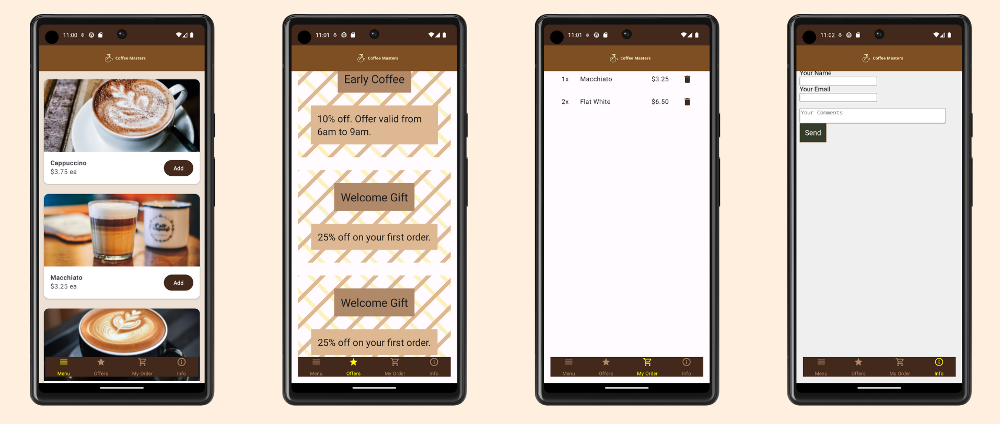

# Coffee Masters app

> Order your favorite coffee quickly and easily!:coffee:

## :iphone: Screenshots

## :rocket: Features
* **Browse Coffee Menu**: 
* [X] Display a list of coffee products with images, descriptions, and prices. 
* [ ] Categorize products.
* [ ] Include search and filtering functionality.
* **Offers Discounts**:
* [X] Offer available discounts and promotions.
* **Add to Cart**:
* [X] Allow users to add coffee items to their shopping cart.
* [ ] Display a dynamic badge with the current item count.
* **Order Management**:
* [X] Allow users to review their order in the cart and to remove items from the cart.
* [ ] Enable users to customize their coffee orders with options such as size.
* [ ] Display a subtotal and total price for the order.
* **Contact Us**:
* [X] Include a form where users can enter their name, email address, and message.

This Android app was built with Kotlin and Jetpack Compose.

---
The application was initially developed following the [Frontend Masters Course](https://frontendmasters.com/courses/android-kotlin/). My goal is to implement future features and redesign the app using [Material 3 guidelines](https://m3.material.io/), to ensure a more robust and user-friendly experience. The app is currently in development. :construction:
